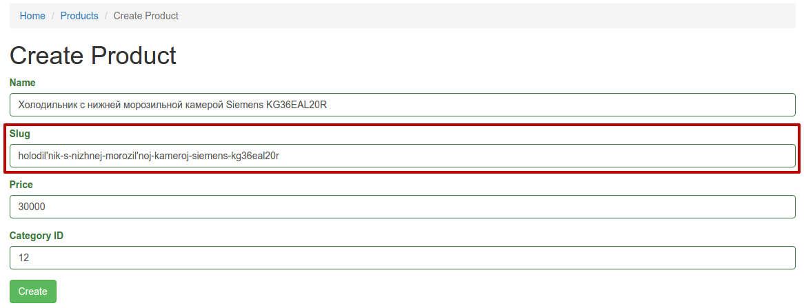
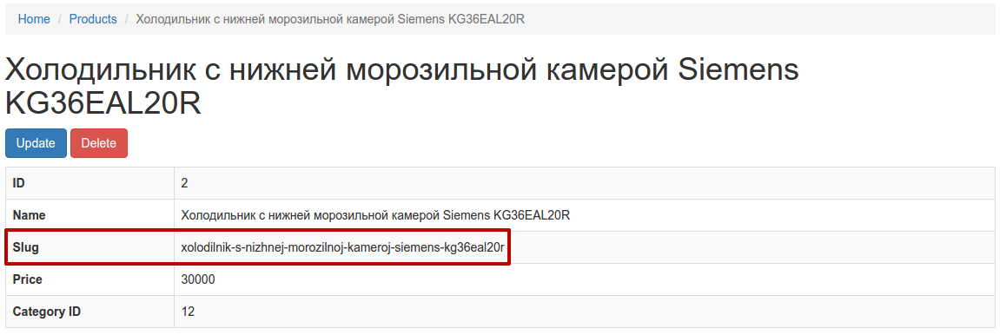

# Генерация ЧПУ-строки (sluggable behavior) для атрибута модели

В некоторых случаях требуется чтобы в структуре проекта к какому-либо объекту можно было обратиться **не по id**, а по какому-то **строковому представлению**, которое будет содержать название объекта в приемлимом для web виде и понятном обычному пользователю.

Адреса, которые содержат такие представления, называют человеко-понятными или **[ЧПУ](https://ru.wikipedia.org/wiki/%D0%A1%D0%B5%D0%BC%D0%B0%D0%BD%D1%82%D0%B8%D1%87%D0%B5%D1%81%D0%BA%D0%B8%D0%B9_URL)**.

Такой адрес страницы воспринимается **понятнее**:

```
http://www.shop.ru/apple/iphone-6S
```

Чем такой:

```
http://www.shop.ru?category=1&product=12
```

Также существует мнение, что наличие **ЧПУ** в адресах проекта **положительно влияет** на его **продвижение** в поисковых системах.

Используя фреймворк Yii2 тоже **можно реализовать** генерацию ЧПУ-строк.

Для начала требуется создать с помощью миграции **модель Product**. Эта модель будет обращаться к таблице БД, которая **хранит список товаров**:

```php
$this->createTable('product', [
    'id' => $this->primaryKey(),
    'name' => $this->string()->notNull(),
    'slug' => $this->string()->notNull(),
    'price' => $this->float()->notNull(),
    'categoryId' => $this->integer(),
]);
```

Также подабятся сам **класс модели** и **интерфейс CRUD** для работы со списком товаров. Все это можно очень быстро создать через **Gii**.

**Название** товара в кириллице пользователь задает в поле **```name```**. А **ЧПУ-представление** этого название должны вручную задаваться в поле **```slug```**:



**Очень долго** для каждого товара **повторять** одну и ту же процедуру. **Преобразовывать** русскоязычное название товара в транслит, **приводить** все символы к нижнему регистру, **убирать** спецсимволы, **заменять** пробелы на тире. Все это потенциально **может привести** к ошибкам и тому, что страница продукта будет **недоступна**.

Необходимо автоматизировать этот процесс.

В этом может помочь библиотека **[php_rutils](https://github.com/andre487/php_rutils)**, которую **необходимо добавить** в проект с помощью **```Composer```**:

```
composer require andre_487/php_rutils
```

После установки **необходимо подключить** её в модель **```Product```**:

```
namespace app\models;

use Yii;
use php_rutils\RUtils;

class Product extends \yii\db\ActiveRecord
{
...
```

И в **том же классе** добавить использование события **```beforeSave```**:

```php
public function beforeSave($insert)
{
    if (parent::beforeSave($insert)) {
        $this->slug = RUtils::translit()->slugify($this->name);
        return true;
    } else {
        return false;
    }
}
```

Здесь перед записью объекта значение атрибута **```$slug```** формируется из атрибута **```$name```** с использованием библиотеки **```php_rutils```**.

Обратите внимание, что для **корректной работы** этого механизма необходимо **не устанавливать** для атрибута **```$slug```** правило **```required```** в методе правил валидации модели **```Product```**.

А в форме заполнения данных по товару атрибут **```$slug```** можно полностью убрать, т.к. он уже **не заполняется** пользователем вручную.

После этого **ЧПУ-представление** названия товара будет формироваться **автоматически и корректно**:



