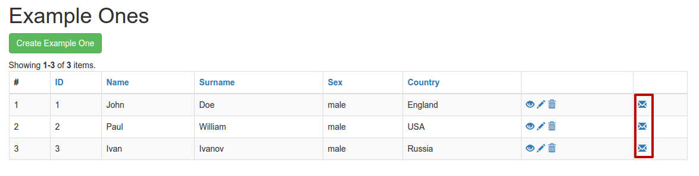

# Добавление своей кнопки в ActionView для колонки GridView

При использовании виджета **GridView** фреймворк строит таблицу, в последней колонке которой находятся элементы управления моделями этой таблицы. Это ссылки на стандатные действия - **Просмотр**, **Редактирование**, **Удаление**.


А что если необходимо добавить свою кнопку с каким-то дополнительным действием?

**Первый вариант (неоптимальный)** - добавить еще одну колонку, в которой возвращать ссылку, которая будет выполнять требуемое действие:

```php
GridView::widget([
    'dataProvider' => $dataProvider,
    'columns' => [
        ['class' => 'yii\grid\SerialColumn'],
        ...
        ['class' => 'yii\grid\ActionColumn'],
        [
            'format' => 'html',
            'value' => function($model) {
                return Html::a(
                    '<span class="glyphicon glyphicon-envelope">',
                    Url::to(['site/action', 'id' => $model->id])
                );
            }
        ]
    ],
]);
```
В случае использовании этого варианта видно, что новая кнопка сильно отдалена от группы других, что является неприемлимым:



**Второй вариант (красивый)** - добавить кнопку к существующей группе кнопок:

```php
GridView::widget([
    'dataProvider' => $dataProvider,
    'columns' => [
        ['class' => 'yii\grid\SerialColumn'],
        ...
        [
            'class' => 'yii\grid\ActionColumn',
            'template' => '{view} {update} {delete} {mail}',
            'buttons' => [
                'mail' => function($model, $key, $index) {
                    return Html::a(
                        '<span class="glyphicon glyphicon-envelope">',
                        Url::to([$model, 'id' => $key])
                    );
                }
            ]
        ],
    ],
]);
```
В данном случае кнопка органично вписывается в группу других кнопок:


