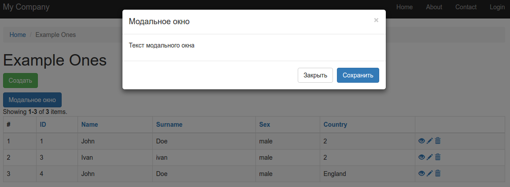

# Создание модального окна

Как известно, по-умолчанию к **Yii2** подключаются стилевые файлы css-фреймворка **Bootstrap**. Это значит, что мы можем использовать все доступные в нем **элементы интерфейса**: выпадающие списки, слайдеры и прочее.

Часто бывает необходимо создать простое **всплывающее** (модальное) окно (окно, которое появляется в центре экрана и содержит в себе какую-либо информацию, при этом вся остальная часть рабочей области затемняется и становится недоступной) с какими-то данными.

**Boostrap** позволяет [очень просто](http://getbootstrap.com/javascript/#modals-examples) сделать это с помощью следующего кода: 

```
<button type="button" class="btn btn-primary" data-toggle="modal" data-target="#myModal">
    Модальное окно
</button>

<div class="modal fade" id="myModal" tabindex="-1" role="dialog" aria-labelledby="myModalLabel">
    <div class="modal-dialog" role="document">
        <div class="modal-content">
            <div class="modal-header">
                <button type="button" class="close" data-dismiss="modal" aria-label="Close"><span aria-hidden="true">&times;</span></button>
                <h4 class="modal-title" id="myModalLabel">Модальное окно</h4>
            </div>
            <div class="modal-body">
                <p>Содержимое модального окна</p>
            </div>
            <div class="modal-footer">
                <button type="button" class="btn btn-default" data-dismiss="modal">Закрыть</button>
                <button type="button" class="btn btn-primary">Сохранить</button>
            </div>
        </div>
    </div>
</div>
```

Чтобы модальное окно действительно работало, сначала нужно **создать кнопку**, которая будет **инициализировать** модальное окно (кликаем по кнопке, получаем окно):

```
<button type="button" class="btn btn-primary" data-toggle="modal" data-target="#myModal">
    Модальное окно
</button>
```

Это может быть как кнопка **```button```**, так и ссылка **```a```**, главное, чтобы элемент содержал data-атрибуты **```data-toggle```** и **```data-target```**. Первый равен значению **```modal```**, второй названию атрибута **```id```**, для связи с блоком всплывающей формы. Да, именно с решеткой **```#```**.

Сам **элемент** модального окна должен содержать атрибут **```id```** со значением, которое было указано в кнопке вызова окна:

```
<div class="modal fade" id="myModal">
```

Внутри блока находятся **три важных элемента**, которые нужно заполнять для создания интерфейса модального окна.

**1) Шапка окна:**

```
<div class="modal-header">
    <button type="button" class="close" data-dismiss="modal" aria-label="Close"><span aria-hidden="true">&times;</span></button>
    <h4 class="modal-title" id="myModalLabel">Модальное окно</h4>
</div>
```

Здесь в базовом примере от **Bootstrap** находится **заголовок формы** и **кнопка закрытия** всей формы.

**2) Контентная область окна:**

```
<div class="modal-body">
    <p>Содержимое модального окна</p>
</div>
```

Здесь также может быть любое **html-содержимое**: форма, таблица, текст, список и другие.

**3) Подвал окна:**

```
<div class="modal-footer">
    <button type="button" class="btn btn-default" data-dismiss="modal">Закрыть</button>
    <button type="button" class="btn btn-primary">Сохранить</button>
</div>
```

Здесь обычно располагаются **элементы управления формой**: кнопка выполнения действия окна (например, отправка формы, если она там есть) и еще одна кнопка закрытия формы.

После окончательной разметки можно получить примерно такую форму:



---

Как всегда, **виджеты Yii2** позволяют нам сэкономить много строк кода.

Для начала подключим **одноименный виджет**, который идет в дистрибутиве фреймворка:

```
use yii\bootstrap\Modal;
```

После этого разместим **php-код** в нужном месте страницы:

```
$header = '<h4 class="modal-title" id="myModalLabel">Модальное окно</h4>';
$footer = '<button type="button" class="btn btn-default" data-dismiss="modal">Закрыть</button>
            <button type="button" class="btn btn-primary">Сохранить</button>';

$modal = Modal::begin([
    'id' => 'myModal',
    'header' => $header,
    'footer' => $footer
]); ?>

<p>Текст модального окна</p>

<?php $modal::end(); ?>
```

Начало блока **модального окна** инициализируется с помощью конструкции:

```
Modal::begin([])
```

Завершение:

```
$modal::end()
```

Вся разметка, которая находится между этими вызовами будет находится **в контентой области** модального окна, т.е. внутри блока:

```
<div class="modal-body">
    <!-- Содержимое будет здесь. Сам блок .modal-body размечать НЕ НАДО --!>
</div>
```

Для **корректной работы** модального окна в инициализации формы нужно заполнить параметры:

```
$modal = Modal::begin([
    'id' => 'myModal',
    'header' => $header,
    'footer' => $footer
]); ?>
```

**```id```** - атрибут для связи с кнопкой вызова формы (**```data-target="#myModal"```**).

**```header```** - содержимое, которое будет выводиться в шапке модального окна:

```
<div class="modal-header">
    <!-- Содержимое будет здесь. Сам блок .modal-header размечать НЕ НАДО --!>
</div>
```

**```footer```** - содержимое, которое будет выводиться в подвале модального окна:

```
<div class="modal-footer">
    <!-- Содержимое будет здесь. Сам блок .modal-footer размечать НЕ НАДО --!>
</div>
```

Параметры **```header```** и **```footer```** должны содержать разметку, которая **будет выводиться** в соответствующих областях модального окна.

Это единственный **неудобный момент** использования виджета, но скорее всего больших блоков разметки **здесь не будет** и все значения можно поместить в соответствующие переменные:

```
$header = '<h4 class="modal-title" id="myModalLabel">Модальное окно</h4>';
$footer = '<button type="button" class="btn btn-default" data-dismiss="modal">Закрыть</button>
            <button type="button" class="btn btn-primary">Сохранить</button>';
```

Которые **нужно указать** при инициализации формы.

Виджет поддерживает и **другие полезные параметры** для создания модального окна.
Исходный код виджета **хорошо документирован**, разобраться во всех его настройках не составит труда.

---

Виджет хорошо подойдет в ситуации, когда нужно быстро **создать простое модальное окно**.
Однако, если надо создать какое-то **специфично стилизованное окно**, виджет не сможет в полной мере реализовать эту задачу.
Придется вставлять на страницу **полный вариант разметки** и вызывать окно с помощью JS/jQuery.
