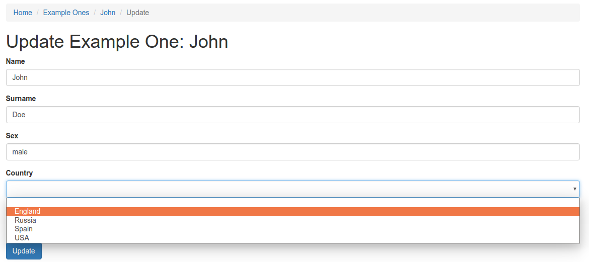

# Указать текущий выбранный элемент списка DropdownList

При работе с формами бывает очень удобно **использовать** для заполнения значений полей **выпадающие списки**. Например, известно, что поле должно содержать **какое-то определенное** значение из известного **списка** значений.
Для этого можно использовать виджет **```ActiveForm```** и его метод **[dropDownList](http://www.yiiframework.com/doc-2.0/yii-widgets-activefield.html#dropDownList()-detail)**:

```php
$form = ActiveForm::begin();

***
$form->field($model, 'country')->dropDownList($selectList);
***

ActiveForm::end();
```

Визуально это выглядит так:



Также возникают ситуации, когда необходимо сделать так, чтобы при загрузке страницы **уже был выбран** указанный элемент выпадающего списка. В примере выше, допустим, вариант - **```Russia```**.

Список опций для выпадающего списка выбора представляет собой обычный массив:

```php
$selectList = [
    '1' => 'England',
    '2' => 'Russia',
    '3' => 'Spain',
    '4' => 'USA'
];
```

Где ключ массива **(1, 2, 3, 4)** будет подставлен в атрибут **```value```** в html-элемент **```option```**, а значение массива **(England, Russia, Spain, USA)** в содержимое элемента выпадающего списка:

```html
<select>
    <option value="1">England</option>
    <option value="2">Russia</option>
    <option value="3">Spain</option>
    <option value="4">USA</option>    
</select>
```

Таким образом, до формирования выпадающего списка необходимо сформировать массив с его вариантами.

Метод **```dropDownList```** первым параметром принимает массив с вариантами для этого списка, а вторым массив опций. В опциях можно указать задать **атрибуты**, которые требуется отобразить для элемента **```select```**. 

Кроме этого здесь можно указать **значение**, которое будет выбранно в списке **по умолчанию**:

```php
$form->field($model, 'country')->dropDownList($selectList,
    ['options' =>
        [2 => 
            [
                'selected' => true
            ]
        ]
    ]
)
```

Здесь подставляется значение, которое **должно соответствовать** ключу массива вариантов выбора для **выпадающего списка**.
В этом случае значение из массива с ключом **```2```** будет выбрано в выпадающем списке при **загрузке страницы** и **инициализации** на ней формы.


